# MemoApp Flow

Last updated: 2026-05-25

이 문서는 현재 코드에 존재하는 실행 흐름만 설명한다. 오래된 계획성 문서는 기준으로 삼지 않는다.

## 1. Local-First Memo Flow

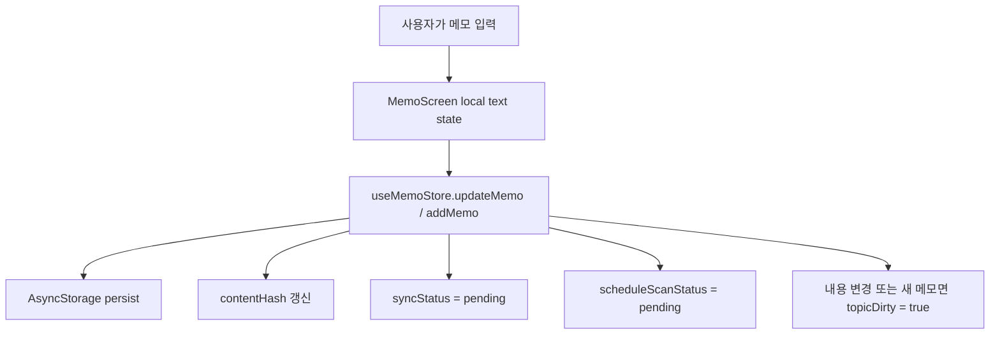

현재 원칙:

- 타이핑 중 backend 호출은 없다.
- 타이핑 중 Supabase write를 남발하지 않는다.
- 메모 작성/수정은 오프라인에서도 가능하다.
- 빈 메모는 store 정리 흐름에서 제거된다.

## 2. Manual Schedule Flow

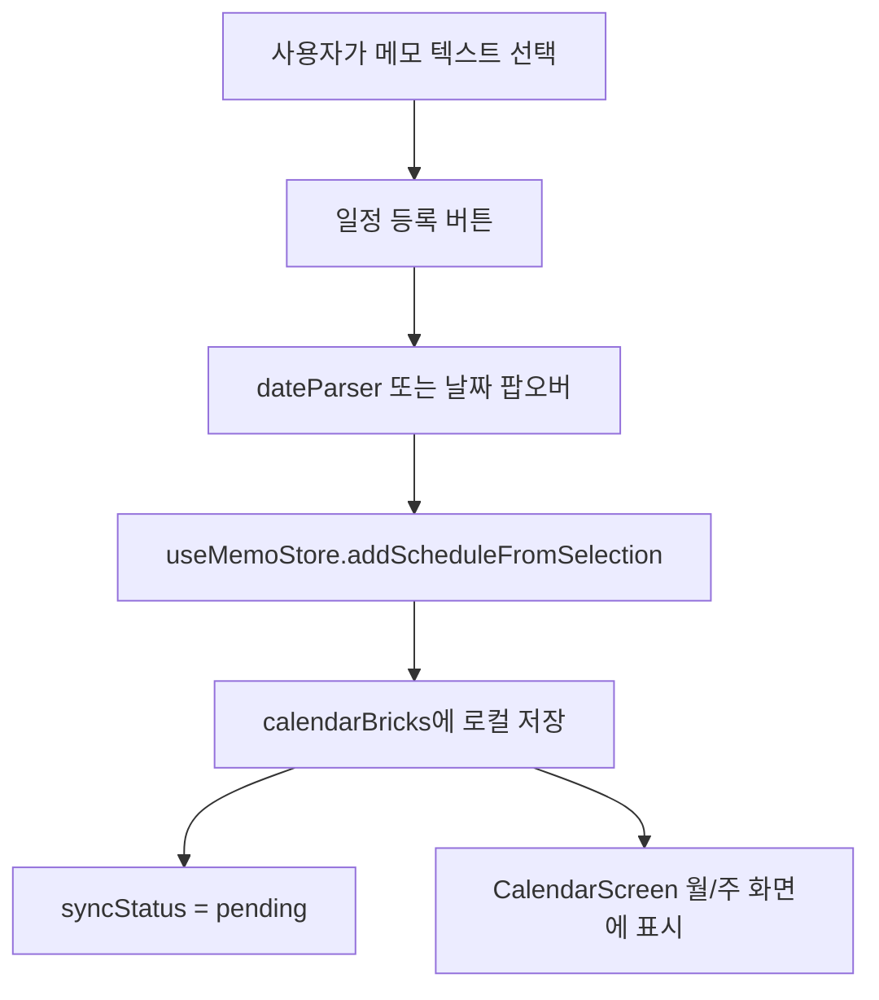

현재 원칙:

- 수동 일정 등록은 로그인 없이 동작한다.
- 수동 일정은 `calendarBricks`에 로컬 저장된다.
- 메모 삭제가 이미 만든 calendar brick을 자동 삭제하지 않는다.

## 3. Optional Sync Flow

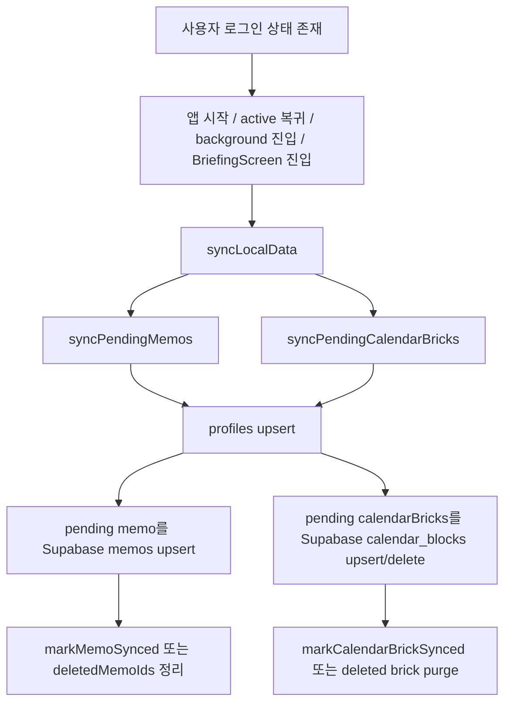

현재 호출 위치:

- `App.tsx`가 Zustand persist hydration 후 첫 sync를 실행한다.
- Supabase auth가 `SIGNED_IN` 또는 `TOKEN_REFRESHED` 상태가 되면 기존 로컬 메모와 캘린더 pending 데이터를 강제 sync한다.
- 앱이 active로 돌아오면 cooldown을 두고 sync를 시도한다.
- 앱이 background로 갈 때는 강제 sync를 시도한다.
- `BriefingScreen`이 schedule inbox를 불러오기 전에 `syncLocalData({ force: true })`를 호출한다.
- schedule inbox 항목을 캘린더에 등록할 때도 강제 sync를 한 번 더 시도한다.

현재 원칙:

- 로그인은 메모 작성의 필수 조건이 아니다.
- 로그인된 경우에만 기기 연동/온라인 기능이 동작한다.
- 비로그인 상태에서 온라인 기능을 직접 누르면 로그인 필요 팝업을 띄운다. 현재 팝업은 Kakao/Google OAuth 연결 전 placeholder다.
- 비로그인으로 쓰던 기존 로컬 메모와 캘린더 블럭은 나중에 로그인하는 시점에 Supabase로 후발 sync된다.
- sync 실패 시 로컬 데이터는 유지되고 `syncStatus = failed` 또는 pending tombstone으로 남아 다음 sync에서 재시도된다.
- 내용이 바뀐 memo만 backend 분석 dirty 필드를 `pending/true`로 리셋한다. 내용이 안 바뀐 단순 sync는 서버가 batch로 갱신한 hash를 다시 덮어쓰지 않는다.

## 4. Automatic Schedule Inbox Flow

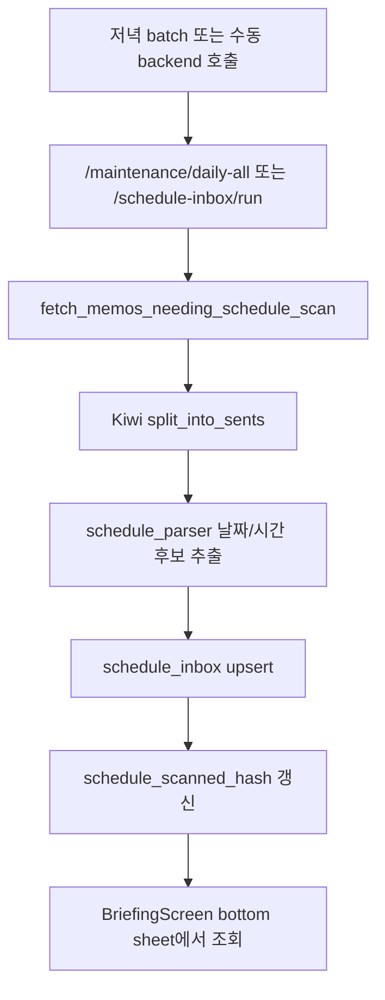

관련 파일:

- `backend/app/schedule_batch.py`
- `backend/app/schedule_parser.py`
- `src/services/supabase/scheduleInboxService.ts`
- `src/features/briefing/BriefingScreen.tsx`

현재 원칙:

- 자동 일정 추천은 온라인 기능이다.
- 앱 작성 화면에서 실시간 추천 UI를 띄우지 않는다.
- backend batch 결과만 `schedule_inbox`에 쌓고, 브리핑 탭이 pending 항목을 보여준다.

## 5. Briefing Inbox Action Flow

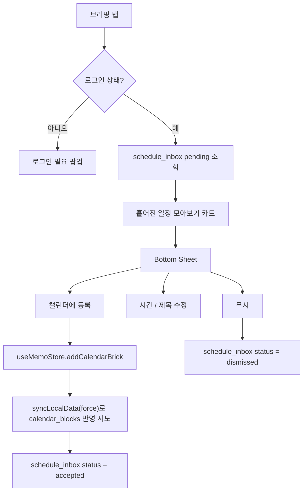

현재 원칙:

- 비로그인 상태에서 일정 inbox를 열면 로그인 필요 안내만 보여준다.
- 등록 액션은 먼저 로컬 calendar brick을 만든다.
- 로그인 상태라면 등록 직후 Supabase `calendar_blocks` sync를 시도한다.
- Supabase 상태 업데이트가 실패해도 로컬 등록은 유지된다.

## 5-1. Daily Briefing Archive Flow

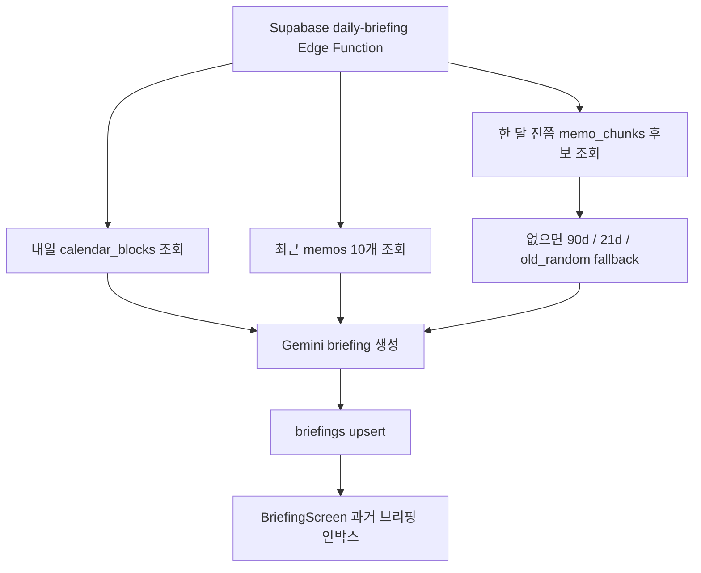

관련 파일:

- `supabase/functions/daily-briefing/index.ts`
- `src/services/supabase/briefingService.ts`
- `src/features/briefing/BriefingScreen.tsx`
- `supabase/migrations/20260519_final_schema.sql`

현재 원칙:

- 과거 생각 기준은 `memos.created_at`이고 사용자에게는 “한 달 전쯤”처럼 표시한다.
- fallback 순서는 `30d -> 90d -> 21d -> old_random`이다.
- `briefings`는 `user_id, type, briefing_date` 기준으로 upsert한다.
- 일정 인박스와 과거 브리핑 인박스는 서로 다른 기능이다.

## 6. State B Network Search Flow

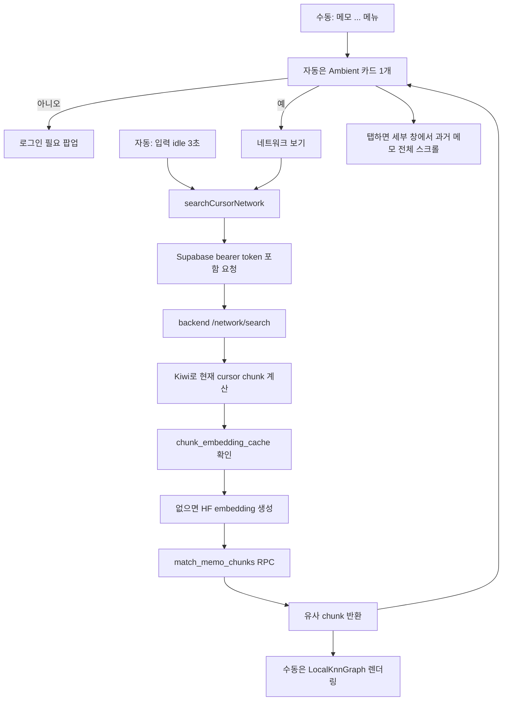

관련 파일:

- `src/services/backend/networkService.ts`
- `src/features/memo/components/MemoNetworkPanel.tsx`
- `src/features/memo/components/LocalKnnGraph.tsx`
- `src/features/memo/components/AmbientNetworkCard.tsx`
- `src/features/memo/components/AmbientNetworkDetailPanel.tsx`
- `backend/app/network_search.py`
- `backend/app/memo_chunking.py`
- `supabase/migrations/20260519_final_schema.sql`

현재 원칙:

- 수동 버튼은 기존 그래프 UI를 유지한다.
- 자동 Ambient Mirror는 타이핑 중 보이지 않고, 입력이 3초 멈췄을 때 유사 문장 1개만 흐리게 보여준다.
- Ambient 세부 창의 초록 하이라이트는 임시 UI이며 메모에 저장하지 않는다.
- 전체 메모 재인덱싱은 버튼 클릭 시 하지 않는다.
- `/network/search`는 Supabase bearer token으로 사용자를 검증한다.

## 7. Memo Chunk Indexing Flow

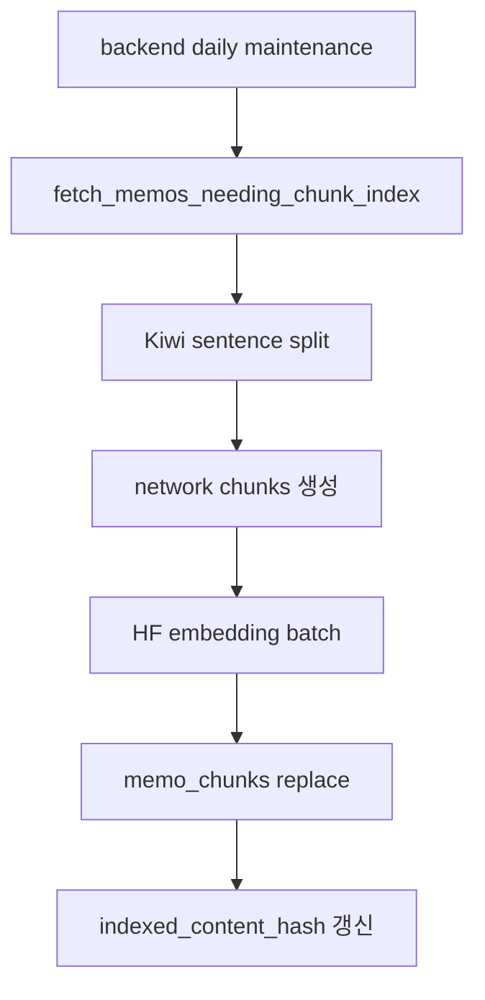

관련 파일:

- `backend/app/memo_indexing.py`
- `backend/app/memo_chunking.py`
- `backend/app/topic_discovery.py`의 `encode_texts`
- `supabase`의 `memo_chunks`

현재 원칙:

- chunk embedding은 batch에서 선처리한다.
- State B 버튼 검색은 선처리된 `memo_chunks`를 대상으로 한다.

## 8. State A Topic Discovery Flow

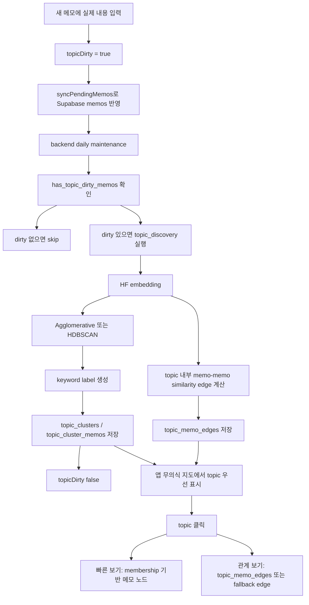

관련 파일:

- `backend/app/topic_discovery.py`
- `backend/app/constants.py`
- `backend/app/db.py`
- `src/services/supabase/topicService.ts`
- `src/features/memo/components/GlobalNetworkGraph.tsx`
- `supabase`의 `topic_clusters`, `topic_cluster_memos`

현재 원칙:

- State A는 앱에서 실시간 실행하지 않는다.
- dirty memo가 없으면 backend가 skip한다.
- 결과는 Supabase topic tables에 저장된다.
- 앱은 `최근 1달 / 최근 6개월 / 최근 1년 / 전체` 필터를 제공하고, topic 데이터가 없으면 로컬 카테고리 그래프로 fallback한다.
- topic을 누르면 빠른 보기와 관계 보기를 모두 제공한다.
- 관계 보기는 `topic_memo_edges`가 있으면 실제 memo-memo similarity를 쓰고, 없으면 membership 점수 기반 fallback edge를 보여준다.

## 9. Daily Maintenance Flow

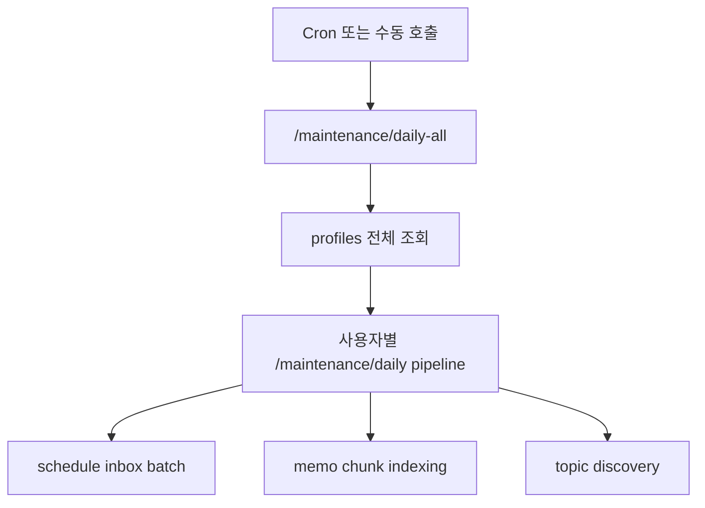

backend endpoint:

- `POST /maintenance/daily`
- `POST /maintenance/daily-all`

보호 방식:

- `BACKEND_ADMIN_KEY`가 설정되어 있으면 `x-backend-admin-key` 헤더가 필요하다.

## 10. Desktop PWA Flow

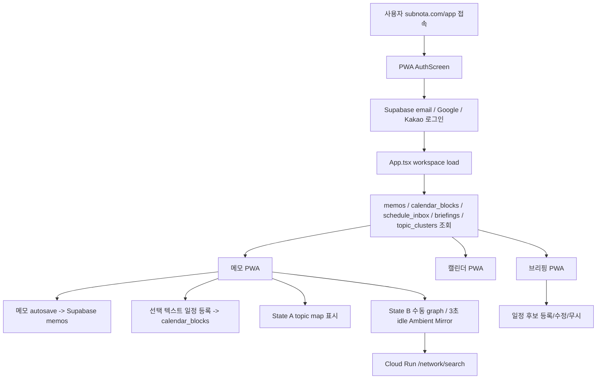

현재 원칙:

- PWA는 로그인 필수로 시작한다.
- PWA에는 service role, Gemini key, HF token을 넣지 않는다.
- State B는 `VITE_MEMO_BACKEND_URL`이 가리키는 Cloud Run backend를 호출한다.
- Cloud Run backend는 `CORS_ALLOW_ORIGINS`에 PWA 도메인을 포함해야 한다.
- PWA State A는 Supabase `topic_clusters` 결과를 보여주며, topic 생성 자체는 backend batch가 담당한다.

## 11. Secret Boundary

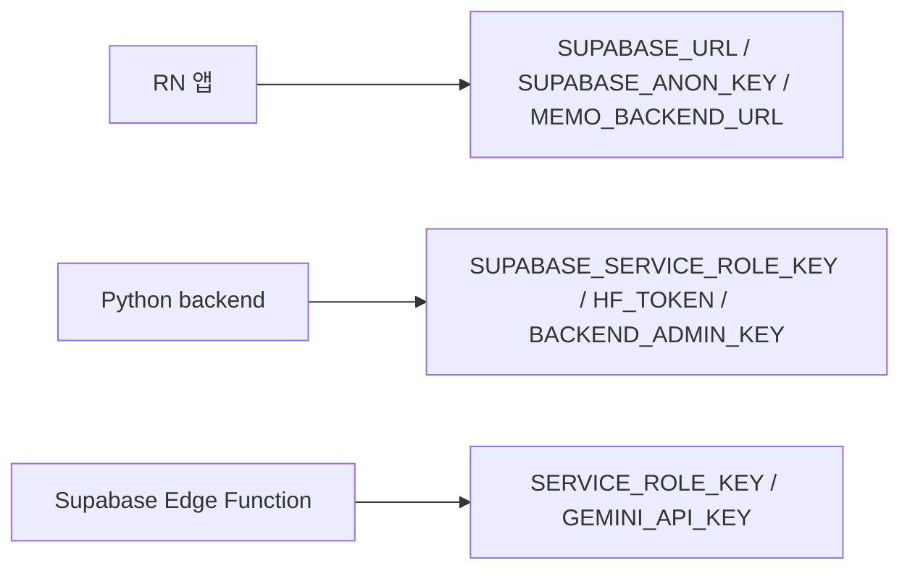

현재 원칙:

- 앱 번들에는 service role, HF token, Gemini API key를 넣지 않는다.
- backend batch는 service role로 Supabase를 읽고 쓴다.
- State B 사용자 요청은 Supabase bearer token으로 user id를 확정한다.
