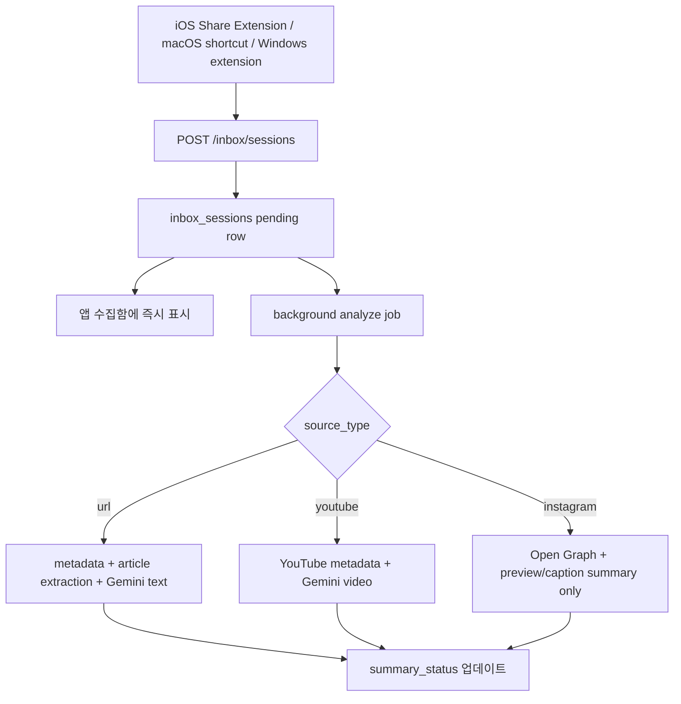

# Share and Capture Plan

Last updated: 2026-05-28

이 문서는 Subnota의 공유/수집 기능을 iOS, macOS DMG, Windows PWA 기준으로 정리한다. 목표는 사용자가 보고 있던 링크를 정리하지 않아도 수집함에 즉시 들어가고, 나중에 메모/일정/무의식 지도와 연결되는 흐름을 만드는 것이다.

## 1. Product Decision

최종 도착지는 하나의 통합 수집함으로 둔다.

```text
수집함
- YouTube
- Instagram
- URL
- 나중에 이미지 캡쳐
```

인박스를 YouTube, Instagram, URL로 나누지 않는다. Subnota의 방향은 "사용자가 정리하지 않아도 된다"에 가깝기 때문이다. 대신 수집함 안에서 타입 라벨과 필터를 제공한다.

```text
전체 / YouTube / Instagram / URL
```

저장은 즉시 끝나야 한다. 요약과 메타데이터 보강은 비동기로 처리한다.

```text
1. 공유/단축키/확장 프로그램으로 URL 수신
2. inbox_sessions row 즉시 생성
3. 앱에는 "저장됨" 카드 표시
4. 백그라운드에서 제목/썸네일/요약 보강
5. 관련 메모, 일정 후보, 무의식 지도와 연결
```

## 2. Platform Flows

### iOS

iOS는 Share Extension을 기본 흐름으로 한다.

```text
YouTube / Instagram / Safari / Chrome
-> 공유하기
-> Subnota 선택
-> 수집함에 즉시 저장
-> 제목/썸네일/링크 먼저 표시
-> 가능한 경우 요약/메타데이터 보강
```

구현은 Share Extension에서 네트워크 저장을 직접 끝내지 않고, App Group의 shared UserDefaults queue에 payload를 남긴 뒤 메인 앱이 로그인 세션으로 API 저장을 처리한다. Apple App Groups는 앱과 extension 사이의 shared container/UserDefaults 접근을 위한 공식 흐름이다.

Share Extension은 최소한 아래 타입을 받는다.

```text
public.url
public.plain-text
```

저장 카드 예시:

```text
[YouTube] 영상 제목
요약 준비 중...

[Instagram] 릴스 저장됨
미리보기 기준으로 저장됨

[URL] 글 제목
본문 또는 메타데이터 기준 저장됨
```

### macOS DMG

macOS는 공유 시트보다 메뉴바 앱과 전역 단축키를 기본 흐름으로 한다.

```text
웹페이지/YouTube/Instagram 보고 있음
-> Command Shift S
-> 현재 활성 브라우저의 탭 제목/URL 읽기
-> Subnota 수집함에 즉시 저장
-> 메뉴바 아이콘/토스트로 저장 피드백
```

메뉴바 아이콘 동작:

```text
좌클릭
-> Mini Subnota 창 열기
-> 현재 페이지 저장 / 빠른 메모 / 최근 수집함 확인

우클릭 또는 두 손가락 클릭
-> 빠른 액션 메뉴 열기
```

빠른 액션 메뉴:

```text
Subnota
────────────────
현재 페이지 저장        Command Shift S
빠른 메모 작성          Command Shift M

최근 수집함
- YouTube 영상 제목
- 블로그 글 제목
- Instagram 링크

────────────────
수집함 열기
설정
종료
```

Mini Subnota는 단순 메뉴가 아니라 작은 앱 창으로 본다.

```text
메뉴바 Subnota 아이콘 클릭
-> 메뉴바 아래에 700x650 정도의 미니 메모장 창
-> 현재 페이지 저장
-> 빠른 메모
-> 최근 수집함
-> 필요하면 현재 페이지에 대해 질문
```

구현 후보:

```text
NSStatusItem
-> 메뉴바 아이콘

NSPanel 또는 NSPopover
-> Mini Subnota floating panel
```

크고 앱 같은 UI를 넣으려면 `NSPanel`이 더 유연하다. 단순 메뉴형이면 `NSPopover`도 가능하다.

권한 안내 문구:

```text
Subnota는 저장 단축키를 누르거나 메뉴바 창을 열 때만 현재 탭의 제목과 URL을 읽습니다.
```

macOS에서 현재 탭 URL 읽기:

```text
Safari
-> AppleScript로 현재 document URL/title 읽기

Chrome / Arc / Edge / Brave
-> Chromium 계열 AppleScript로 active tab URL/title 읽기

Firefox
-> MVP 제외
```

메뉴바 고정은 `NSStatusItem`으로 처리한다. "가장 앞" 고정은 macOS 메뉴바의 시스템 아이콘보다 앞에 강제로 놓는 기능이 아니라, status item을 앱이 계속 유지하고 사용자가 System Settings > Control Center / Menu Bar에서 재배치하지 않는 한 사라지지 않게 하는 방향으로 본다.

### Windows PWA

Windows는 PWA 단독으로 현재 브라우저 탭을 안정적으로 읽기 어렵다. 따라서 Chrome 확장 프로그램을 1차 흐름으로 한다.

```text
Chrome에서 페이지 보고 있음
-> Ctrl Shift S
-> 확장 프로그램이 현재 탭 제목/URL 읽기
-> Subnota PWA의 capture URL로 전달
-> PWA가 로그인 세션으로 Subnota API 저장
```

확장 프로그램 메뉴:

```text
현재 페이지 저장
선택한 텍스트와 함께 저장
빠른 메모 추가
Subnota 수집함 열기
```

Chrome Extension은 `commands` API로 단축키를 받고, `activeTab` 권한으로 사용자 호출 시점에만 현재 탭 URL/title을 읽는다. `activeTab`은 전체 사이트 상시 권한보다 권한 부담이 작다.

PWA 자체에는 Web Share Target도 추가할 수 있다. 다만 Windows 데스크탑의 주 흐름은 "공유하기"보다 브라우저 확장 단축키가 자연스럽다. Edge는 Chrome 확장 MVP가 안정화된 뒤 같은 Manifest V3 코드베이스로 확장한다.

## 3. Data Model

새 테이블은 `inbox_sessions`를 기준으로 잡는다.

```sql
create table inbox_sessions (
  id uuid primary key default gen_random_uuid(),
  user_id uuid not null references auth.users(id) on delete cascade,
  source_type text not null check (source_type in ('youtube', 'instagram', 'url', 'image')),
  original_url text,
  canonical_url text,
  domain text,
  title text,
  description text,
  thumbnail_url text,
  raw_shared_text text,
  selected_text text,
  user_note text,
  summary text,
  summary_status text not null default 'pending',
  summary_basis text,
  summary_provider text,
  metadata jsonb not null default '{}',
  created_at timestamptz not null default now(),
  updated_at timestamptz not null default now()
);
```

상태값:

```text
summary_status
- pending: 저장은 됐고 분석 대기
- ready: 요약 완료
- partial: 제목/설명/미리보기 기준으로 일부만 저장
- unsupported: 플랫폼 제한으로 요약하지 않음
- failed: 시도했지만 실패

summary_basis
- 본문 기준
- 영상 기준
- 제목/설명 기준
- 미리보기 기준
- 사용자 메모 기준
```

출처를 명확히 남겨야 한다. 특히 Instagram처럼 실제 콘텐츠 접근이 제한되는 경우 "내용 요약 완료"라고 표시하면 신뢰가 깨진다.

## 4. Source Detection

URL 수신 후 서버에서 source type을 분류한다.

```text
youtube
- youtube.com/watch
- youtu.be/*
- youtube.com/shorts/*

instagram
- instagram.com/reel/*
- instagram.com/p/*
- instagram.com/stories/* 는 대부분 제한됨

url
- 그 외 http/https URL
```

분류는 먼저 URL host/path로 한다. LLM으로 source type을 판단하지 않는다.

## 5. Metadata and Summary Strategy

요약은 자동으로 시도하되, 저장 성공의 필수 조건은 아니다. 모든 링크를 LLM에 억지로 넣지 않는다.

기본 원칙:

```text
1. 원본 URL과 제목을 먼저 저장한다.
2. 플랫폼별로 안정적인 메타데이터를 수집한다.
3. YouTube와 공개 웹페이지는 백그라운드에서 자동 요약을 시도한다.
4. 실패하면 partial/unsupported 상태로 남긴다.
```

### Generic URL

권장 순서:

```text
1. 서버에서 URL fetch
2. Open Graph / Twitter Card / title / meta description 추출
3. HTML 본문에서 article text 추출
4. 본문이 충분하면 LLM으로 3-5줄 요약
5. 본문이 부족하면 제목/설명 기준 partial 저장
```

권장 구현:

```text
Metadata
-> Open Graph, Twitter Card, HTML title/meta description

본문 추출
-> Readability 계열 parser 또는 자체 HTML text extraction

요약
-> 현재 구현은 Gemini 2.5 Flash text prompt
```

Generic URL은 서버가 직접 fetch/parse한 본문을 Gemini text model에 넣는 방식을 기본으로 한다. Gemini URL Context는 빠른 프로토타입에는 좋지만, 실패/차단/본문 선택 기준을 앱이 제어하기 어렵기 때문에 현재 MVP 핵심 경로에서는 제외한다.

권장 판단:

```text
현재 MVP
-> 직접 fetch + metadata + 본문 추출
-> LLM은 본문이 충분할 때 자동 key point 요약

후보
-> Gemini URL Context를 fallback 또는 실험 옵션으로 사용
```

### YouTube

YouTube는 2가지 접근을 분리해야 한다.

#### A. 안전한 메타데이터 저장: YouTube Data API 또는 oEmbed

YouTube Data API 키가 있으면 `videos.list`로 아래 정보를 가져온다.

```text
title
description
channelTitle
publishedAt
duration
thumbnails
```

YouTube Data API 키가 없으면 YouTube oEmbed로 title/thumbnail/author를 가져온다. 이 방식들은 안정적이지만 영상 내용을 직접 읽는 것은 아니다.

권장 상태:

```text
summary_status = partial 또는 ready
summary_basis = 제목/설명 기준 또는 영상 기준
summary_provider = youtube_data_api / youtube_oembed / gemini_youtube_url
```

장점:

```text
공식 API
빠르고 안정적
썸네일/제목 품질 좋음
```

한계:

```text
영상 본문을 이해하지 못함
설명이 빈약한 영상은 요약 품질이 낮음
API quota 관리 필요
```

#### B. 영상 내용 자동 요약: Gemini Video Understanding

Gemini API는 공개 YouTube URL을 입력으로 받아 영상 이해를 시도할 수 있다. 현재 구현은 YouTube 저장 후 백그라운드에서 Gemini 2.5 Flash에 URL을 전달해 key point 요약을 자동 시도한다.

권장 상태:

```text
summary_status = ready
summary_basis = 영상 기준
summary_provider = gemini_video_understanding
```

장점:

```text
영상 내용을 직접 요약할 수 있음
사용자가 원하는 "영상 링크 넣으면 요약" 경험에 가까움
별도 transcript 확보 없이 시작 가능
```

한계:

```text
YouTube URL 기능은 preview 성격이 있음
공개 영상 중심으로 봐야 함
연령 제한/비공개/지역 제한/로그인 필요 영상은 실패 가능
비용과 지연 시간이 생김
항상 정확하다고 가정하면 안 됨
```

권장 판단:

```text
현재 MVP 기본값
-> YouTube Data API 키가 있으면 제목/설명/썸네일 저장
-> 키가 없으면 oEmbed로 제목/썸네일 저장
-> Gemini 영상 요약 자동 시도
-> 실패하면 partial 유지

품질 강화 옵션
-> 사용자 재요약 버튼
-> 긴 영상/실패 영상 retry queue
-> YouTube API quota/latency 모니터링
```

YouTube transcript는 주의한다. YouTube Data API의 captions 관련 기능은 임의 공개 영상의 transcript를 자유롭게 가져오는 일반 요약 API가 아니다. 비공식 transcript scraping 라이브러리는 동작은 쉬울 수 있지만, 서비스 안정성/정책 리스크가 있다. 출시용 MVP의 핵심 경로로 두지 않는다.

권장 YouTube 처리 흐름:

```text
1. URL 저장
2. videoId 추출
3. YouTube Data API 또는 oEmbed로 metadata 저장
4. 수집함에는 즉시 카드 표시
5. Gemini 영상 요약은 background job으로 자동 시도
6. 실패하면 제목/설명 기준 partial 유지
```

사용자 표시 예:

```text
[YouTube] 회의 질문 잘하는 법
제목/설명 기준으로 저장됨

또는

[YouTube] 회의 질문 잘하는 법
영상 기준 요약 완료
```

### Instagram / Reels

Instagram은 보수적으로 설계한다.

권장 기본값:

```text
1. 원본 URL 저장
2. 가능하면 oEmbed 또는 Open Graph metadata 저장
3. 썸네일/캡션이 가능할 때만 partial 표시
4. description/caption 미리보기가 있으면 Gemini text 요약을 시도
```

상태:

```text
summary_status = partial 또는 unsupported
summary_basis = 미리보기 기준
summary_provider = instagram_oembed 또는 open_graph
```

장점:

```text
사용자는 링크를 잃어버리지 않음
릴스/게시글을 수집함에서 다시 찾을 수 있음
무리한 scraping 없이 시작 가능
```

한계:

```text
로그인/권한/비공개/삭제 콘텐츠에 취약
릴스 영상 내용을 안정적으로 직접 요약하기 어려움
oEmbed도 앱 권한/정책 영향을 받음
```

사용자 표시 예:

```text
[Instagram] 릴스 저장됨
미리보기 기준으로 저장됨
```

Instagram에 대해 실제 영상 접근 없이 "영상 내용 요약 완료"라고 표현하지 않는다. 현재 구현에서는 공개 OG/미리보기 description이 있으면 "미리보기/캡션 기준"으로만 표시한다.

## 6. LLM Provider Decision

LLM은 수집 기능의 필수 의존성이 아니다. 저장과 재방문 가능성이 먼저다.

권장 역할:

```text
LLM이 하는 일
- 충분한 본문이 있을 때 3-5줄 요약
- 제목을 더 읽기 좋게 정리
- 사용자가 남긴 짧은 메모를 정돈
- 관련 메모/일정 후보 설명 문장 생성

LLM이 하지 않는 일
- source type 판단
- URL 저장 성공 여부 결정
- Instagram 콘텐츠를 본 척 요약
- 접근 불가능한 페이지의 내용을 추측
```

Provider별 판단:

```text
Gemini Video Understanding
- YouTube 공개 영상 자동 요약 후보
- 성공하면 제품 임팩트가 크다
- preview/제한/비용/지연을 감안해 실패 fallback을 반드시 둔다

Gemini text model
- 직접 추출한 공개 웹페이지 본문/metadata를 key point로 요약
- Instagram은 공개 미리보기/description 범위에서만 요약
- provider 교체 가능하게 서버 내부 adapter로 감싼다

No LLM
- 제목/설명/썸네일만으로도 저장 경험은 성립한다
- MVP fallback으로 반드시 유지한다
```

권장 provider abstraction:

```ts
type SummaryInput = {
  sourceType: 'youtube' | 'instagram' | 'url' | 'image';
  url?: string;
  title?: string;
  description?: string;
  extractedText?: string;
  selectedText?: string;
  userNote?: string;
};

type SummaryResult = {
  status: 'ready' | 'partial' | 'unsupported' | 'failed';
  summary?: string;
  basis: 'video' | 'article_body' | 'metadata' | 'preview' | 'user_note';
  provider: string;
};
```

## 7. Backend Jobs

API는 저장과 분석을 분리한다.

```text
POST /inbox/sessions
-> URL/text/user_note 저장
-> inbox_sessions row 즉시 반환

POST /inbox/sessions/{id}/analyze
-> metadata fetch
-> source-specific enrichment
-> optional summary
-> row 업데이트
```

실제 운영에서는 `analyze`를 클라이언트가 직접 기다리지 않고 background job으로 실행한다.



## 8. Security and Privacy

권한은 사용자가 명시적으로 저장 액션을 했을 때만 쓴다.

```text
iOS
-> 사용자가 공유 시트에서 Subnota를 선택한 항목만 수신

macOS
-> 사용자가 메뉴바 창을 열거나 단축키를 누른 순간에만 현재 탭 URL/title 읽기

Windows
-> 확장 프로그램 command/action/context menu 호출 시점에만 activeTab 권한 사용
```

macOS 권한:

```text
Apple Events / Automation
-> Safari, Chrome, Arc, Edge, Brave의 현재 탭 title/url을 읽을 때 사용자 허가 필요

App Sandbox + automation entitlement
-> 배포/서명 설정에서 com.apple.security.automation.apple-events 필요
```

서버에는 아래를 저장한다.

```text
필수
- original_url
- source_type
- created_at

권장
- title
- thumbnail_url
- description
- summary
- summary_basis

선택
- selected_text
- user_note
```

저장하지 않는 것을 명확히 둔다.

```text
브라우저 전체 방문 기록
페이지 전체 HTML 원본 장기 보관
로그인 세션/cookie
사용자가 공유하지 않은 탭 정보
```

## 9. Current MVP Scope

```text
1. inbox_sessions schema 추가
2. 앱/PWA에 통합 수집함 UI 추가
3. URL 저장 API 추가
4. 일반 URL Open Graph metadata 저장
5. YouTube videoId/title/thumbnail 저장
6. YouTube 공개 URL Gemini 자동 요약
7. Generic URL 본문 추출 + Gemini key point 요약
8. Instagram은 URL 저장 + 가능한 미리보기/캡션 기준 요약
9. iOS Share Extension
10. macOS 메뉴바 앱 + Mini Subnota + Command Shift S
11. Chrome extension + Ctrl Shift S
```

성공 기준:

```text
공유/단축키를 누르면 1초 안에 수집함 카드가 생긴다.
요약이 없어도 원본 링크와 제목은 잃어버리지 않는다.
YouTube와 공개 웹페이지는 자동 요약을 시도한다.
Instagram은 접근 가능한 공개 미리보기 범위만 요약한다고 표시한다.
```

## 10. Settled Decisions

```text
YouTube
-> 자동 Gemini 영상 요약 시도
-> YouTube API key는 권장, 없으면 oEmbed fallback

Generic URL
-> 직접 metadata/body 추출
-> Gemini text model로 key point 자동 요약

Instagram
-> 링크/미리보기/캡션 기준까지만 약속
-> 실제 영상 내용 요약이라고 말하지 않음

macOS
-> Safari/Chrome/Arc/Edge/Brave 먼저
-> Firefox 제외

Windows
-> Chrome 확장 프로그램 먼저
```

## 11. References

- Gemini Video Understanding: https://ai.google.dev/gemini-api/docs/video-understanding
- Gemini URL Context: https://ai.google.dev/gemini-api/docs/url-context
- Gemini Google Search grounding: https://ai.google.dev/gemini-api/docs/google-search
- YouTube Data API videos.list: https://developers.google.com/youtube/v3/docs/videos/list
- Instagram oEmbed: https://developers.facebook.com/docs/instagram-platform/oembed
- Chrome Extension commands API: https://developer.chrome.com/docs/extensions/reference/api/commands
- Chrome Extension activeTab permission: https://developer.chrome.com/docs/extensions/develop/concepts/activeTab
- Web Share Target manifest: https://developer.mozilla.org/en-US/docs/Web/Progressive_web_apps/Manifest/Reference/share_target
- AppKit NSStatusItem: https://developer.apple.com/documentation/appkit/nsstatusitem
- AppKit NSPopover: https://developer.apple.com/documentation/appkit/nspopover
